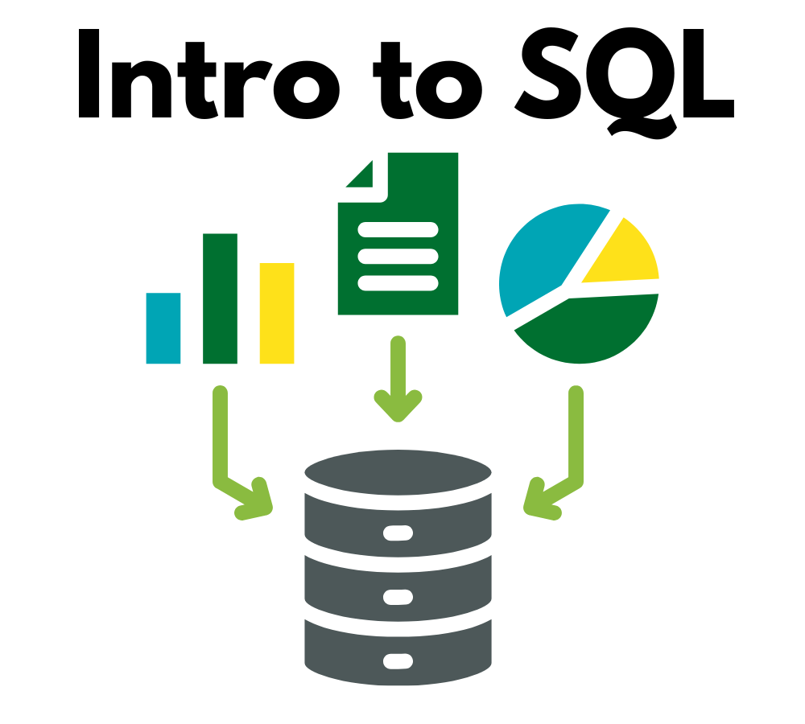

{width=400 fig-align="center"}

## About
This interactive workshop teaches the fundamentals of using SQL (Structured Query Language) to extract and analyze data from relational databases. Learn how to sort, filter, aggregation, and join data with SQL by writing your own queries!

No experience with SQL required, though participants may benefit from familiarity with programming languages like R or Python. 

## Sessions

* April 7, 2026, 1pm—2pm: Setup, Introduction
* April 9, 2026, 1pm—2pm: Selection Fundamentals
* April 14, 2026, 1pm—2pm: TBA
* April 16, 2026, 1pm—2pm: TBA
* April 21, 2026, 1pm—2pm: TBA
* April 23, 2026, 1pm—2pm: TBA