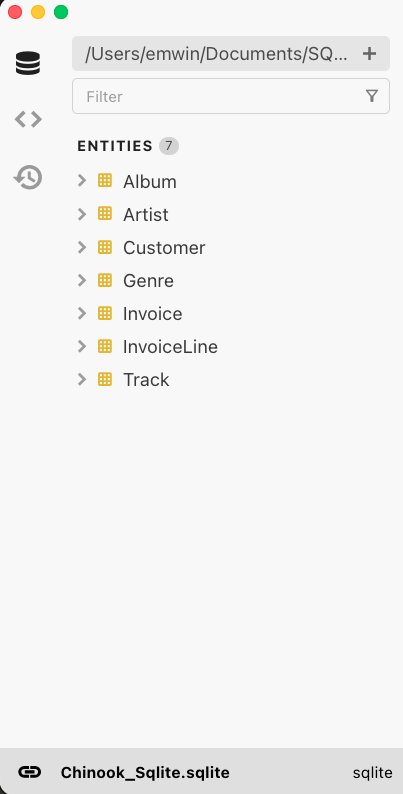
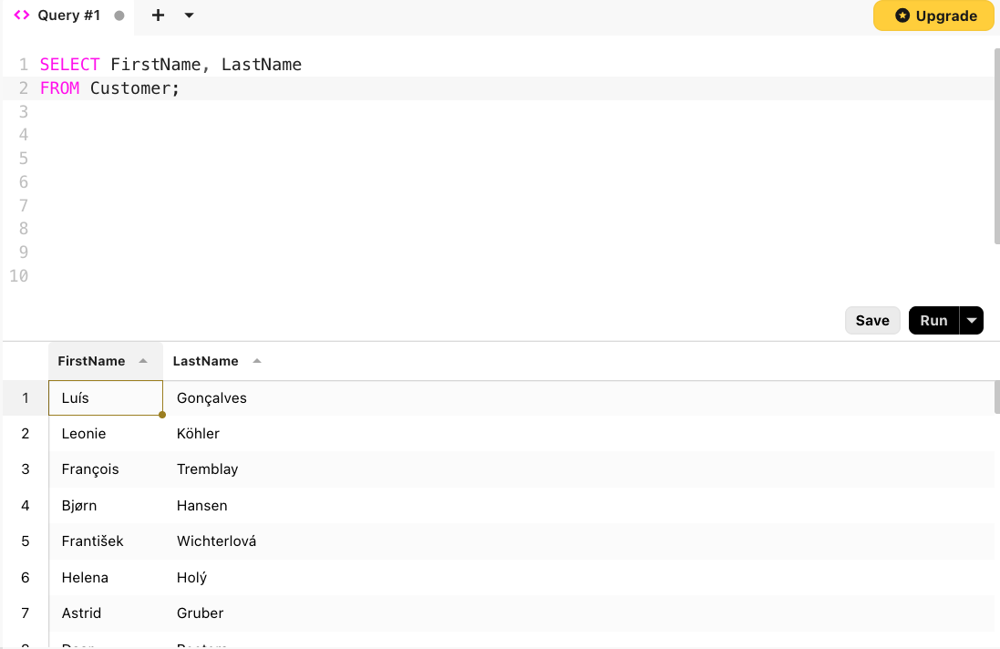

## Why Use Relational Databases?

Technically, any collection of structured information, whether a spreadsheet or set of files, can
be considered a database. However, this class will focus on a specific family of databases: relational databases.
**Relational databases** organize information into tables. They have been a fixture of
businesses, non-profits, and educational institutions for decades.

Databases grew out of a need for secure, robust, and concurrently accessible records. Databases allow
administrators to restrict which users can read, write, or delete information on a table by table basis. For example,
at an educational institution like the University of Oregon, it is important that students see their own
information but not information pertaining to other students.

We will not get into the details of *how* databases are managed in this workshop, but it is
important to understand that SQL (as a query language) works independently of the implementation of the
database. Despite advances in computing technology, many databases still retain
the tabular structure popularized in the 80s and 90s.

## Relational Databases: Tables
{width=700 fig-align="center"} 

A relational database stores information in **tables** or **entities**.
Each table has a set of columns and a variable number of records.

### Attributes
* Each **attribute** (also known as a field or column) has an associated data type. 
You will encounter the following SQL data types in this workshop:
    - **integer**: a signed whole number
    - **numeric**: used for storing decimals or floats
    - **varchar(n)**/**nvarchar(n)**: a string (text) of at most n characters, including spaces
    - **char(n)**: a string (text) of exactly n characters, including spaces
    - **datetime**: a date and time string in the form `'YYYY-MM-DD 00:00:00'`
* Every value within that column *must* be of the specified data type, or (when-permitted) `NULL`. 

### Records
* Every **record** or **row** has the same number of attributes.
* There is no limit on the number of records in a table. However, for performance reasons, SQL
tables should be no larger than they need to be to store required information.

## Introducing the Workshop Database

Before using SQL to query the data, let’s inspect the structure
and contents of our music store database. 

### Table and Field Names
#### Album
* A table of musical albums
* `AlbumId` - integer
* `Title` - nvarchar(160)
* `ArtistId` - integer

#### Artist
* A table of artist and band names
* `ArtistId` - integer
* `Name` - nvarchar(120)

#### Customer
* A table of customer name and address information
* `CustomerId` - integer
* `FirstName` - nvarchar
* `LastName` - nvarchar
* `Company` - nvarchar
* `Address` - nvarchar
* `City` - nvarchar
* `State` - nvarchar
* `Country` - nvarchar
* `PostalCode` - nvarchar

#### Genre
* A table of musical genres
* `GenreId` - integer
* `Name` - nvarchar(120)

#### Invoice
* A table of invoices, with customer ids and itemized totals
* `InvoiceId` - integer
* `CustomerId` - integer
* `InvoiceDate` - datetime
* `BillingAddress` - nvarchar(70)
* `BillingCity` - nvarchar(40)
* `BillingState` - nvarchar(40)
* `BillingCountry` - nvarchar(40)
* `BillingPostalCode` - nvarchar(10)
* `Total` - numeric 

#### InvoiceLine
* A table of invoice components, outlining individual purchases
* `InvoiceLineId` - integer
* `InvoiceId` - integer
* `TrackId` - integer
* `UnitPrice` - numeric
* `Quantity` - integer

#### Track
* A table of track metadata
* `TrackId` - integer
* `Name` - nvarchar
* `AlbumId` - integer
* `GenreId`- integer
* `Composer` - nvarchar
* `Milliseconds` - integer
* `Bytes` - integer
* `UnitPrice` - numeric


### First Peek: Schema Diagrams

Schema diagrams are used to represent relationships between tables in a database.

{width=800 fig-align="left"}

The structure of this database will be explained in more detail as more SQL concepts are introduced. 
Remote attendees will receive a digital copy of this schema diagram, while in-person attendees will receive a handout.
Think of this schema diagram as a roadmap to your database!

## Exploring the Database in Beekeeper Studio

### The Beekeeper Studio Interface

{width=400 fig-align="left"}

On the left side of Beekeeper Studio, there is a navigation pane with three icons.

* The first, a database symbol, allows you to inspect the structure and properties of the current database.
* The second allows you to see your saved queries. We'll talk about saving queries shortly.
* Finally, the third allows you to see all the queries you've run in the current workspace, including ones you may not have saved.

## SELECT, FROM, and LIMIT

For our first query, let's list the first and last names of each customer known to have purchased music from the store.
To do this, we need the keywords **SELECT** and **FROM**.

Click the **+** button in the Beekeeper Studio editor pane to open a new query console and type the following.

{width=700 fig-align="left"}

### Unpacking a First SQL Query 

```sql
SELECT FirstName, LastName 
FROM Customer;
```

* `FROM` is the most important part of the query. It must be followed by the name of a table in the database.
* `SELECT` is followed by comma-separated names of fields within that table.
* Every SQL query ends with a semicolon `;`.

::: {.callout-note}
SQL is case-insensitive, but it's best practice to capitalize keywords like
`SELECT` and `FROM`. It makes it easier to distinguish between keywords and values, which
are typically camel case or title case.
:::

To change the order of columns in our ourput, we can rewrite the order as
follows:

```sql
SELECT LastName, FirstName
FROM Customer;
```

As a shortcut, we can select all of the columns in a table using `*`:

```sql
SELECT *
FROM Customer;
```

The `*` symbol tells SQL to display all of the fields in the table
from left to right.

### Controlling Output with `LIMIT`
The `Customer` table has 59 rows, which is more than we want
to read at once. Luckily, SQL has keyword that
limits the number of rows returned.

At the end of any SQL command, just before the semicolon, use
the keyword `LIMIT` followed by a number of rows to indicate
how many rows we want to return.

* `LIMIT` must be followed by a positive integer.

```sql
SELECT LastName, FirstName
FROM Customer
LIMIT 5;
```
| LastName    | FirstName |
| ----------- | --------- |
| Gonçalves   | Luís      |
| Köhler      | Leonie    |
| Tremblay    | François  |
| Hansen      | Bjørn     |
| Wichterlová | František |

#### Quiz: Try it Yourself
What SQL query will you give the email address of the first five customers in the Customer table?  

::: {.callout-tip collapse="true"}
## Answer
```sql
SELECT Email
FROM Customer
LIMIT 5;
```
| Email                    |
| ------------------------ |
| luisg@embraer.com.br     |
| leonekohler@surfeu.de    |
| ftremblay@gmail.com      |
| bjorn.hansen@yahoo.no    |
| frantisekw@jetbrains.com |
:::


