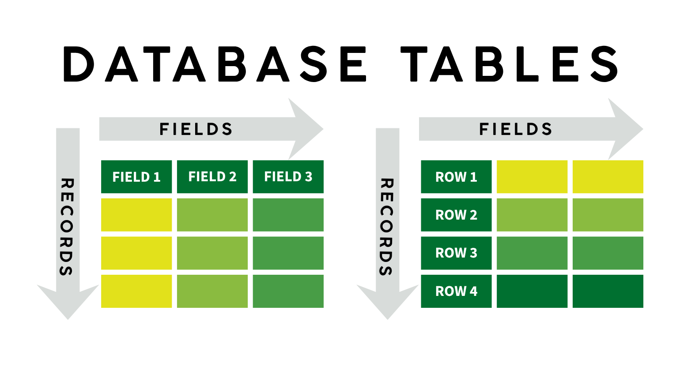

## Why Use Relational Databases?

Technically, any collection of structured information, whether a spreadsheet or set of files, can
be considered a database. However, this class will focus on a specific family of databases: relational databases.
**Relational databases** organize information into tables. They have been a fixture of
businesses, non-profits, and educational institutions for decades.

Databases grew out of a need for secure, robust, and concurrently accessible records. Databases allow
administrators to restrict which users can read, write, or delete information on table by table basis. For example,
at an educational institution like the University of Oregon, it is important that students see their own
information but not information pertaining to other students.

We will not get into the details of *how* databases are managed in this workshop, but it is
important to understand that SQL (as a query language) works independently of the implementation of the
database. Despite advances in computing technology, many databases still retain
the tabular structure popularized in the 80s and 90s.

## Relational Databases: Tables
{width=700 fig-align="center"} 

A relational database stores information in **tables** or **entities** each of which has a 
fixed set of columns and a variable number of records.

### Fields
* Each **attribute** has an associated data type. You will encounter the following SQL
data types in this workshop:
    - **integer**: a signed whole number
    - **numeric**: used for storing decimals or floats
    - **varchar(n)**/**nvarchar(n)**: a string (text) of at most n characters, including spaces
    - **char(n)**: a string (text) of exactly n characters, including spaces
    - **datetime**: a date and time string in the form `'YYYY-MM-DD 00:00:00'`
* Every value within that column *must* be of the specified data type, or (when-permitted) `NULL`. 

### Records
* Every **record** has the same number of attributes.
* There is no limit on the number of records in a table. However, for performance reasons, SQL
tables should be no larger than they need to be to store required information.

