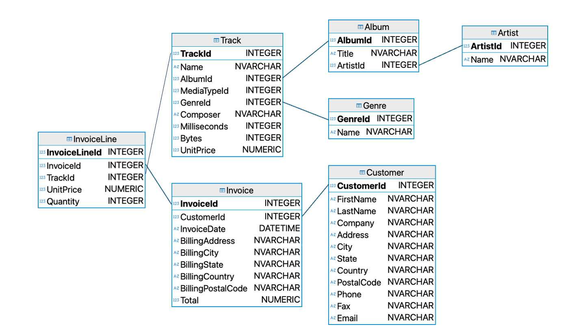
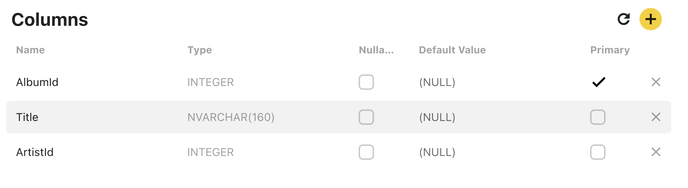
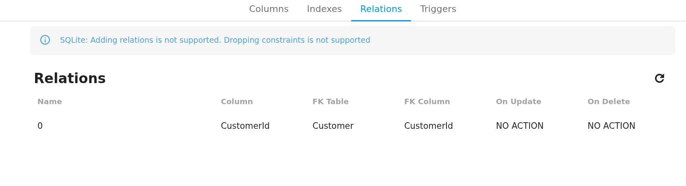
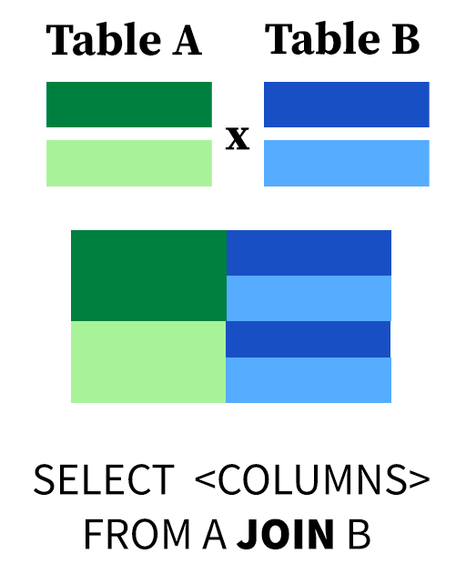
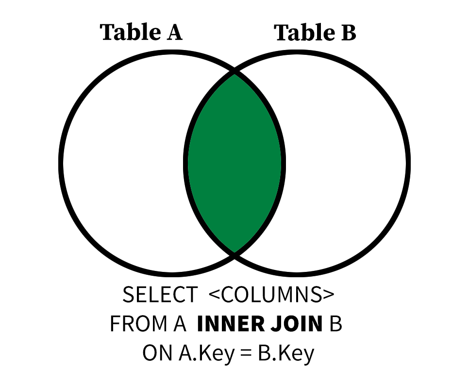

## A Refresher: The Seven SQL Clauses

We have now learned the seven potential SQL clauses, and these
make up the backbone of most SQL SELECT queries.

* `SELECT` - filter, aggregate, and assign aliases to columns
* `FROM` - selects which tables to read from
* `WHERE` - filter input rows based on conditions
* `GROUP BY` - aggregate rows by their values in a column or columns
* `HAVING` - filter grouped rows
* `ORDER BY` - sort output
* `LIMIT` - restrict output to the first n rows

Keeping track of all the potential clauses can be
intimidating, so it's best to start with the simple parts of
you query and add complexity. For example, always start
with the `FROM` clause, to make sure you're reading from the
correct table(s), before filtering to your desired rows
with `WHERE`. Don't worry about `HAVING` until you're confident with
the groups formed with `GROUP BY`. 

#### Quiz: Putting It All Together
Write a query that counts the number of invoices(rows)
in each `BillingState`, `BillingCountry` group in the `Invoice`
table, filtered to rows where `BillingState` is not null,
with groups filtered to groups with at least 5 rows, ordered 
by `BillingState` in ascending alphabetical order, and restricted to the
first five results. Use the alias `Invoices` for the number of 
rows per group. 

This is a complex query, so start from the
following template with hints!

```sql
SELECT BillingState, BillingCountry, --- AS ----
FROM Invoice 
WHERE --- IS NOT NULL
GROUP BY BillingState, BillingCountry
HAVING COUNT(*) ---
ORDER BY BillingState 
LIMIT;
```

::: {.callout-tip collapse="true"}
## Answer 
You will need to use `COUNT(*)` or the `Invoices` alias
in the `HAVING` clause get your desired results here!

```sql
SELECT BillingState, BillingCountry, COUNT(*) as Invoices
FROM Invoice 
WHERE BillingState IS NOT NULL 
GROUP BY BillingState, BillingCountry
HAVING COUNT(*) > 5
ORDER BY BillingState
LIMIT 5;
```
| BillingState | BillingCountry | Invoices |
| ------------ | -------------- | -------- |
| AB           | Canada         | 7        |
| AZ           | USA            | 7        |
| BC           | Canada         | 7        |
| CA           | USA            | 21       |
| DF           | Brazil         | 7        |
:::

## Primary Keys

{width=800 fig-align="left"}

Remember this diagram? It's time to decode it.

* Each table is one box.
* Underneath the name of each table is a list of every
column in that table, followed by that field's data type.
* The first field, indicated in bold, is special. This bolded
field is called a primary key.

A **primary key** is a field (or sets of fields) that uniquely identifies
rows within a table. Every primary key must be not null, and no two rows can 
have the same primary key. You will see real-world databases with
primary keys that are made up of combinations of fields, and the 
same principles apply to each unique set of values.
Primary keys often take the form `[tablename]Id`.

You can also evaluate which field functions as the primary key 
from within the Beekeeper Studio interface. In the interface pane on 
the left side of the screen, right-click on the name of a table and click
**View Structure**.

{width=800 fig-align="left"}

A new tab in the Beekeeper Studio interface will open displaying information about each column in
the table. The `Primary` checkbox indicates whether or not the field is a primary key. The `Nullable`
checkbox indicates whether or not a field can take on a nul value. The `Type` column lists the 
data type of each field.

#### Quiz: Primary Keys
Which of the following is the primary key of the Album table?
```{r, echo=FALSE}
opts_p <- c(
   answer = "AlbumId",
   "Title",
   "ArtistId"
)
```

`r longmcq(opts_p)`

Database designers decide which fields in a table can be null, their data types, and
their default values based on the properties of the data stored in the database. These
constraints have important ramifications for how the database interacts with software and
the validity of its records. As a database user, it is important for you to understand
what the constraints of your database are, even if you don't have the authority to change them.

#### Quiz: Nullables
Which of the following fields in the `Invoice` table can be null? Ask yourself why.
```{r, echo=FALSE}
opts_s <- c(
   "InvoiceId",
   "CustomerId",
   "Total",
   answer = "BillingState"
)
```

`r longmcq(opts_s)`

## Foreign Keys
It's time to tackle the final, undiscussed element of the schema diagram: the connections between tales. 
Each line in the schema diagram represents a foreign key relationship.

A foreign key is a field (or set of fields) in one table whose values are a primary key in another table. That means that every (non-null) 
foreign key value must have a corresponding row in another table. 

Take the `Album` table. The `Album` table has `AlbumId` for its primary
key, but the `ArtistId` field is a foreign key linked to the `Artist`
table. That means that if we see an `ArtistId` of `6` in `Album`, we
can be confident that the row in `Artist` with `ArtistId=6` corresponds
to the same entity.

As viewing schema diagrams is a premium feature of Beekeeper Studio, I have provided a
diagram as generated in another program for you. Luckily, you can view secondary key relationships
in the **View Structure -> Relations** tab of Beekeeper Studio.

{width=800 fig-align="left"}

In the screenshot above, the `Invoice` table lists `CustomerId` as being a *FK* or foreign key, tied
to the `Customer` tabler. This means that all `CustomerId` values in `Invoice` must correspond to 
exactly one row in `Customer`.

There are 4 types of relationships between database tables:

* One to One - each item in the first table has exactly one match in the second table.
* One to Many - each item in the first table is related to many items in the second table, sometimes represented as 1 to * or 1 to ∞
* Many to One - many items in the first table is related to one item in the second table.
* Many to Many - many items in the first table are related to many items in the second table.

Schema diagrams will often use special symbology to indicate these relationships to the users of a 
database. I selected the Chinook database because the distinction between 1:1 to 1:* relationships
is fairly intuitive.

For example, it's only natural that a `CustomerId` can be linked to multiple purchases in `Invoice`.

#### Quiz: Foreign Keys
Use Beekeeper Studio to view the structure and contents of the `InvoiceLine` and `Invoice` tables. 
Which of the following statements about these tables is true?
```{r, echo=FALSE}
opts_p <- c(
   "InvoiceLineId is a foreign key in the Invoice table that refers to the InvoiceLine table.",
   answer="InvoiceId is a foreign key in the InvoiceLine table that refers to the Invoice table.",
   "The InvoiceId and InvoiceLineId fields have a 1:1 relationship."
)
```

`r longmcq(opts_p)`

### Why Not Just Use One Big Table?
When you look at songs on a music store or on a streaming platform, you *see* the information related
to each song as one big table. The album, artist, and track information is included on every row, even if
much of that information is repeated. For example, we know that every track on `AlbumId=3` will have
the same album title, but that title is displayed over and over to the user.

Databases are structured to reduce redundancy through a design process called 
normalization. Normalization makes databases more resilient to human
error. I chose the Chinook database because it already demonstrates 
good database design principles. It is broken down into several tables to make sure that each "fact" (relationship between fields)
stated as few times as possible. 

We can reconstruct larger tables through a process called joining. Good database tables are
easy to join with each other, provided we take advantage of their foreign key relationships.

## A Gentle Introduction to `JOIN`
Joining tables in SQL can get messy and complicated. We will focus on simple joins based on best practice
that produce consistent, meaningful results. 

{width=400 fig-align="center"}

All `JOIN` operations represented a subset of the cross-product (or Cartesian product)
(though they aren't *implemented* this way) between two tables. The
cross-product of tables A and B is the sum of all possible combinations
of rows in A and B, which creates a table of size (rows in A * rows in B).

This query computes the cross-product of `Customer` and `Invoice` 
using the `JOIN` keyword.

```sql
SELECT *
FROM Customer JOIN Invoice;
```

* The `Customer` table has 59 rows and 12 columns.
* The `Invoice` table has 412 rows and 9 columns.
* The result of this query has 59 * 412 = 24308 rows
and 12 + 9 = 21 columns.
* Observe that columns with the same name are repeated in 
the results.

This query *could* tell us something useful. From the
structure of the database, we know that every purchase
in `Invoice` has an associated `CustomerId`. Joining
the two tables could give us the purchase history of
each customer, linking name and location information to purchases.

The problem is that only rows where the `CustomerId` is 
shared between two tables provide meaningful information.
That is, there isn't a meaningful link between an invoice
with `CustomerId=3` and the first and last name of `CustomerId=5`.

`JOIN` is followed by the keyword `ON`, which allows joins
based on conditional relationships between two tables. 
All `JOIN` operations you will learn going forward will have 
an `ON` condition.

```sql
SELECT *
FROM Customer 
JOIN Invoice ON Customer.CustomerId = Invoice.CustomerId;
```

* The output of this query has 412 columns and 21 rows.
* This makes sense if we think carefully. Each of the
412 rows in `Invoice` has a non-null `CustomerId`, and therefore
(as a foreign key) a matching a `CustomerId` in the `Customer`
table.

Notice that we used Table.field to specify field names in the output of the join. 
This is because tables can have fields with the same name.

{width=800 fig-align="left"}

The `JOIN` we just performed is called an `INNER JOIN`. In the
future, I will use the keyword `INNER JOIN` to refer to these joins
to distinguish them from `LEFT` and `FULL OUTER` JOINS.

We can now filter our joined input using `SELECT` and `WHERE`
clauses. The following query gives the `FirstName`, `LastName`,
`InvoiceDate`, and `Total` of each customer and their 
associated purchases, provided the customer has the string
`John` somewhere in their name.

```sql   
SELECT FirstName, LastName, InvoiceDate, Total
FROM Customer JOIN Invoice ON Customer.CustomerId = Invoice.CustomerId
WHERE FirstName LIKE '%John%';
```
| FirstName | LastName | InvoiceDate         | Total |
| --------- | -------- | ------------------- | ----- |
| John      | Gordon   | 2021-01-11 00:00:00 | 13.86 |
| John      | Gordon   | 2021-09-11 00:00:00 | 8.91  |
| John      | Gordon   | 2023-04-18 00:00:00 | 1.98  |
| John      | Gordon   | 2023-07-21 00:00:00 | 3.96  |
| John      | Gordon   | 2023-10-23 00:00:00 | 5.94  |
| John      | Gordon   | 2024-06-12 00:00:00 | 0.99  |
| John      | Gordon   | 2025-12-04 00:00:00 | 1.98  |

#### Quiz: A First JOIN Practice
Let's say you want to find the `AlbumId`, `Title`, and (Artist) `Name` of every album in the
`Album` table with the word `'Greatest'` in its title. This will require you join the 
`Album` table to the `Artist` table. I have provided boilerplate to get you started.

* Use `ArtistName` as an alias for `Name` for clarity.
* Order by `Title` in ascending order.
* Don't forget to express your join fields in `table.field` form.

```sql
SELECT ---
FROM Album JOIN Artist ON --- = -----
WHERE Title LIKE ---
ORDER BY ---'
```

::: {.callout-tip collapse="true"}
## Answer 
```sql
SELECT AlbumId, Title, Name as ArtistName
FROM Album JOIN Artist ON Album.ArtistId = Artist.ArtistId 
WHERE Title LIKE '%Greatest%'
ORDER BY Title;
```
| AlbumId | Title                              | ArtistName        |
| ------- | ---------------------------------- | ----------------- |
| 141     | Greatest Hits                      | Lenny Kravitz     |
| 185     | Greatest Hits I                    | Queen             |
| 36      | Greatest Hits II                   | Queen             |
| 37      | Greatest Kiss                      | Kiss              |
| 162     | Motley Crue Greatest Hits          | Mötley Crüe       |
| 202     | Rotten Apples: Greatest Hits       | Smashing Pumpkins |
| 215     | The Police Greatest Hits           | The Police        |
| 67      | Vault: Def Leppard's Greatest Hits | Def Leppard       |
:::