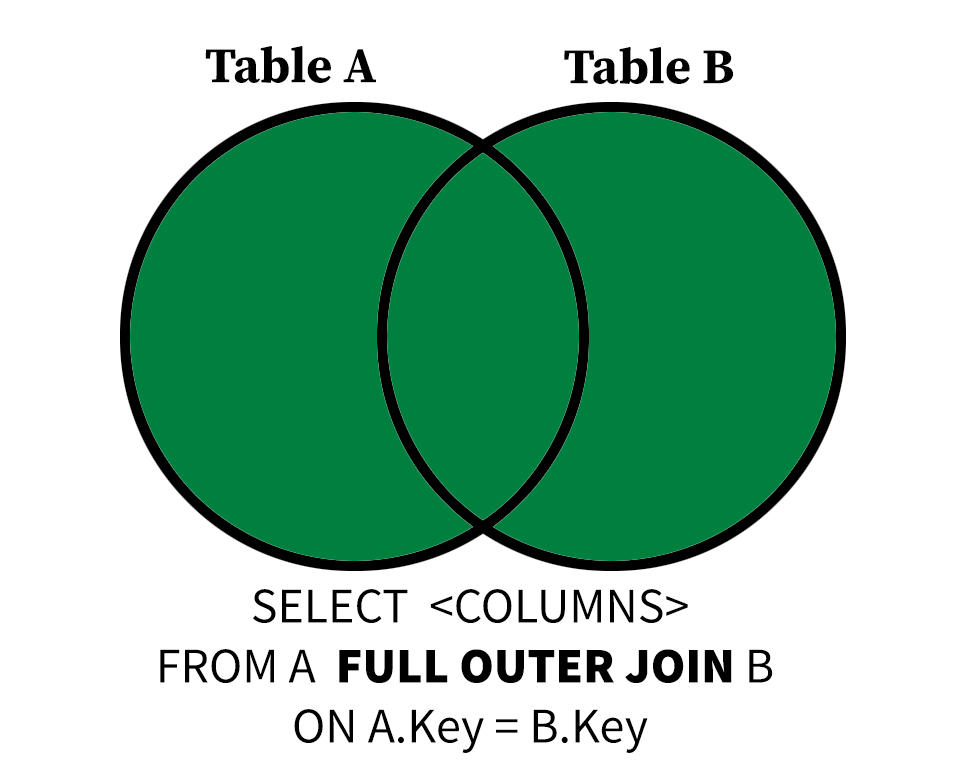
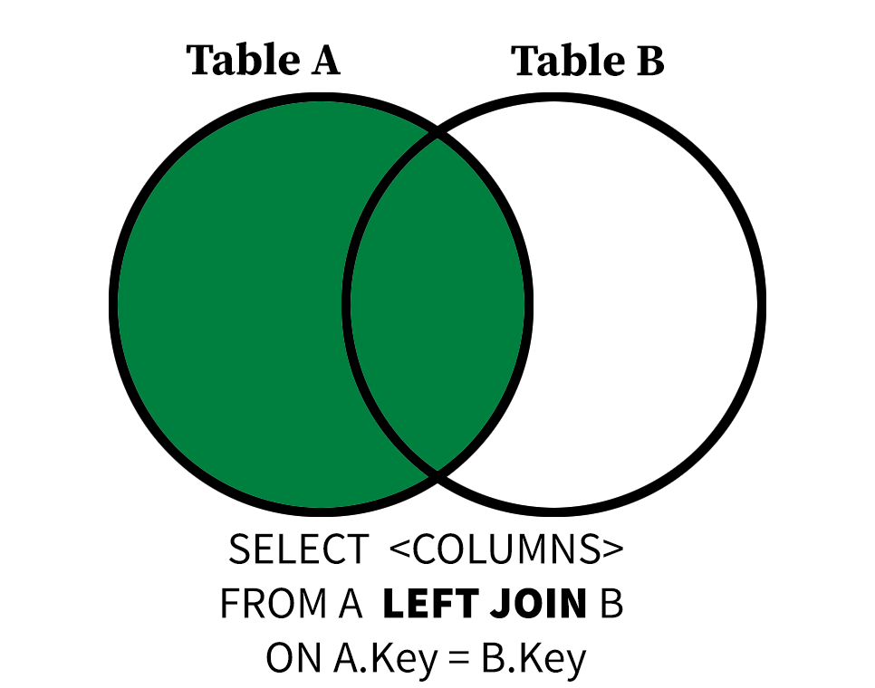
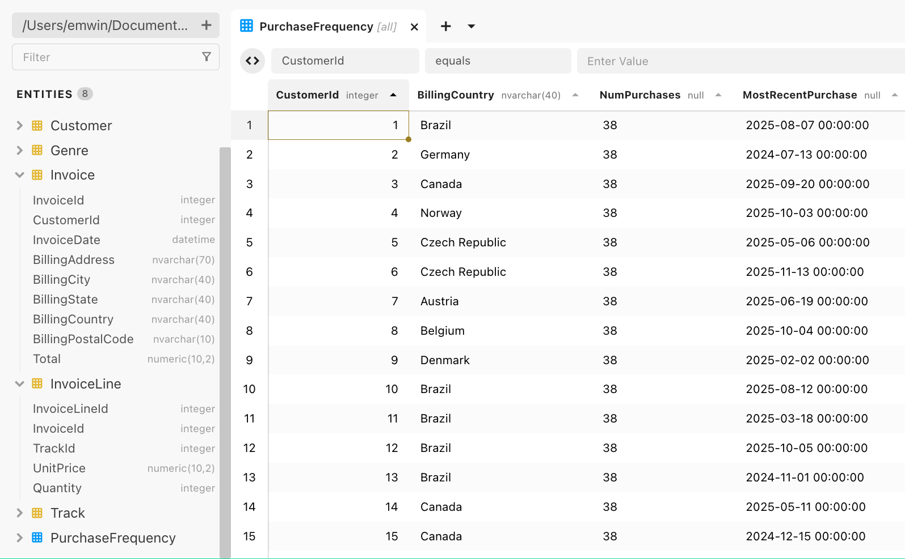

## Using Other SQL Clauses with INNER JOIN

{width=800 fig-align="left"}

In our last lesson, you were introduced to the `JOIN` or `INNER JOIN` operation,
which, given a match between columns expressed in `TABLE1.col1`, `TABLE2.col2`
form, allows you to create a new result with a row corresponding to each
pair of matching rows between the two tables.

Joins are typically peformed between fields that are linked by a primary key/foreign 
key relationship. This allows us to ask complex questions about the same objects, people, or
records by aggregating or concatenating information distributed across multiple tables.
 
When using `SELECT *` with joined tables, you will see every column
in both tables, even when columns are repeated. 

::: {.callout-important}
Null values are not considered equal to each other, so an `INNER JOIN` will **not**
return rows where both A and B of `ON A = B` are null.
:::

```sql
SELECT * 
FROM Genre INNER JOIN Track
ON Track.GenreId = Genre.GenreId
LIMIT 5;
```
| GenreId | Name                                    | TrackId | AlbumId | Composer                                                                     | Milliseconds | Bytes    | UnitPrice |
| ------- | --------------------------------------- | ------- | ------- | ---------------------------------------------------------------------------- | ------------ | -------- | --------- |
| 1       | For Those About To Rock (We Salute You) | 1       | 1       | Angus Young, Malcolm Young, Brian Johnson                                    | 343719       | 11170334 | 0.99      |
| 1       | Balls to the Wall                       | 2       | 2       | U. Dirkschneider, W. Hoffmann, H. Frank, P. Baltes, S. Kaufmann, G. Hoffmann | 342562       | 5510424  | 0.99      |
| 1       | Fast As a Shark                         | 3       | 3       | F. Baltes, S. Kaufman, U. Dirkscneider & W. Hoffman                          | 230619       | 3990994  | 0.99      |
| 1       | Restless and Wild                       | 4       | 3       | F. Baltes, R.A. Smith-Diesel, S. Kaufman, U. Dirkscneider & W. Hoffman       | 252051       | 4331779  | 0.99      |
| 1       | Princess of the Dawn                    | 5       | 3       | Deaffy & R.A. Smith-Diesel                                                   | 375418       | 6290521  | 0.99      |

You can use `SELECT` followed by
column names to restrict the results to specific columns, just as you 
would any other query. 

```sql
SELECT TrackId, UnitPrice
FROM Genre INNER JOIN Track ON Track.GenreId = Genre.GenreId
LIMIT 5;
```
| TrackId | UnitPrice |
| ------- | --------- |
| 1       | 0.99      |
| 2       | 0.99      |
| 3       | 0.99      |
| 4       | 0.99      |
| 5       | 0.99      |

However, if your joined tables have a column of the same name,
you will be prompted to use `table.col_name` format in the `SELECT` clause.


```sql
SELECT Name
FROM Genre INNER JOIN Track
ON Track.GenreId = Genre.GenreId
LIMIT 5;
```
```output
ambiguous column: Name
```

In the example above, both `Genre` and `Track` have `Name` fields, but
`Name` in the `Genre` table represents a genre, 
while `Name` in `Track` is the name of a song. 

```sql
SELECT Track.Name, Genre.Name
FROM Genre INNER JOIN Track
ON Track.GenreId = Genre.GenreId
LIMIT 5;
```
| Name                                       | Name   |
| --------------------------------------- | ---- |
| For Those About To Rock (We Salute You) | Rock |
| Balls to the Wall                       | Rock |
| Fast As a Shark                         | Rock |
| Restless and Wild                       | Rock |
| Princess of the Dawn                    | Rock |

Using `table.field` notation makes the intent of the query
clear to the SQL engine, but these results are no longer clearly to a 
human interpreter of the data: there are two different fields called `Name`. 

```sql
SELECT Track.Name as Track, Genre.Name as Genre
FROM Genre INNER JOIN Track
ON Track.GenreId = Genre.GenreId
LIMIT 5;
```
| Track                                   | Genre |
| --------------------------------------- | ----- |
| For Those About To Rock (We Salute You) | Rock  |
| Balls to the Wall                       | Rock  |
| Fast As a Shark                         | Rock  |
| Restless and Wild                       | Rock  |
| Princess of the Dawn                    | Rock  |

Using `AS` aliases make the query results more human-readable. 
Use aliases liberally when performing joins and other
complicated SQL queries.

When performing `INNER JOIN` operations, the number of rows in the
result will be the same regardless of whether you join A to B or B to A,
provided you use the same joining condition. This makes sense,
given what we know about inner joins. If `A=B`, then `B=A`.

```sql
SELECT Track.Name AS Title, Genre.Name AS Genre
FROM Track INNER JOIN Genre
ON Track.GenreId = Genre.GenreId
LIMIT 5;
```
| Title                                   | Genre |
| --------------------------------------- | ----- |
| For Those About To Rock (We Salute You) | Rock  |
| Balls to the Wall                       | Rock  |
| Fast As a Shark                         | Rock  |
| Restless and Wild                       | Rock  |
| Princess of the Dawn                    | Rock  |

### `GROUP BY` and Joins

We can use `GROUP BY` and `HAVING` clauses with joined tables. Just like
with `SELECT`, using `table.field` form is the `GROUP BY` cluase is
 sometimes necessary to avoid ambiguity.

The following query computes the five most popular genres of `Track` in the
database by joining the `Genre` and `Track` tables and counting the number
of tracks *per* genre with `COUNT`. Then, these groups are sorted
by the number of tracks per genre or `NumTracks`.

```sql
SELECT Genre.Name, COUNT(DISTINCT TrackId) as NumTracks
FROM Genre INNER JOIN Track 
ON Track.GenreId = Genre.GenreId
GROUP BY Genre.Name
ORDER BY NumTracks DESC 
LIMIT 5;
```
| Name               | NumTracks |
| ------------------ | --------- |
| Rock               | 1297      |
| Latin              | 579       |
| Metal              | 374       |
| Alternative & Punk | 332       |
| Jazz               | 130       |

Observe that `Genre.Name` is used in the `GROUP BY` clause rather than
`Name` because both `Genre` and `Track` have a field named `Name`.

#### Quiz: JOIN and GROUP BY
Write a query that finds the CustomerId, FirstName and LastName of the 3 customers who spent the most money (sum of `Total`)
by joining the `Invoice` and `Customer` tables on `CustomerId`.

```sql
SELECT Customer.CustomerId, FirstName, LastName, -----
FROM Customer INNER JOIN ----- ON ------ = ---------
GROUP BY Customer.CustomerId, FirstName, LastName
ORDER BY ------ ------
LIMIT 3;
```
::: {.callout-tip collapse="true"}
## Answer 
```sql
SELECT Customer.CustomerId, FirstName, LastName, SUM(Total)
FROM Customer INNER JOIN Invoice 
ON Customer.CustomerId = Invoice.CustomerId
GROUP BY Customer.CustomerId, FirstName, LastName 
ORDER BY SUM(Total) DESC
LIMIT 3;
```
| CustomerId | FirstName | LastName   | SUM(Total) |
| ---------- | --------- | ---------- | ---------- |
| 6          | Helena    | Holý       | 49.62      |
| 26         | Richard   | Cunningham | 47.62      |
| 57         | Luis      | Rojas      | 46.62      |
:::

### Joins Gone Wrong: Joining Against Arbitrary Fields
Just because two fields in two database tables share the same name
doesn't mean they are good candidates for joins.
Foreign key relationships make for good joins because you can make guarantees
about the shape and cardinality (the number of rows) in your results.
Remember, primary keys correspond to at most one row in their respective tables.

What happens if we do an arbirtary many-to-many join? Let's take `UnitPrice`
as it appears in `Track` and `UnitPrice` as it appears in `InvoiceLine`.
These both correspond to the price of a song or television episode from 
the `Track` table.

```sql
SELECT Track.Name, InvoiceLine.UnitPrice
FROM InvoiceLine INNER JOIN Track ON Track.UnitPrice = InvoiceLine.UnitPrice
ORDER BY Track.Name;
```

This query produces an enormous result!
Because many rows in `Track` have the same `UnitPrice` (0.99) and many rows in `InvoiceLine`
have the same `UnitPrice` (0.99), it produces a table of size 7028053 rows.

## Other Joins: `FULL OUTER JOIN` and `LEFT JOIN`
As stated above, `INNER JOIN` operations ignore tuples that have null values in the column used to
join tables in *either* of the tables being joined. This isn't always desirable, especially when the *absence* of
a certain foreign key in a table is meaningful.

{width=800 fig-align="left"}
The `FULL OUTER JOIN` operation includes input tuples "padded" with `NULL` values if either side of the join
has unmatched tuples. This means every row in each of the tables in a `FULL OUTER JOIN` is included at least once
in the output.

Let's take the `InvoiceLine` and `TrackId` tables for example to see this difference. 
Each `InvoiceLine` has a non-null `TrackId`, but not every `Track` in the `Track` table
has been purchased. How do we know?

This `INNER JOIN` has 2240 results, even though the `Track` table has 3503 rows. This is because
any tracks that have one or more corresponding rows in the `InvoiceLine` do not
appear in the results.

```sql
SELECT Track.TrackId, InvoiceLineId
FROM Track INNER JOIN InvoiceLine ON Track.TrackId = InvoiceLine.TrackId;
```

If it was important that *every* track (and every invoice line) be included in the results, then we 
could use a FULL OUTER JOIN instead, which returns 3759 rows. This is because some tracks have
been purchased twice, while others have never been purchased. 

```sql
SELECT Track.TrackId, InvoiceLineId
FROM Track FULL OUTER JOIN InvoiceLine ON Track.TrackId = InvoiceLine.TrackId;
```

We can then apply grouping to this join to learn more about the distribution of track
purchases. 

```sql
SELECT Track.TrackId, COUNT(DISTINCT InvoiceLineId) as NumPurchases
FROM Track FULL OUTER JOIN InvoiceLine ON Track.TrackId = InvoiceLine.TrackId
GROUP BY Track.TrackId;
```
| TrackId | NumPurchases |
| ------- | ------------ |
| 1       | 1            |
| 2       | 2            |
| 3       | 1            |
| 4       | 1            |
| 5       | 1            |
...

By restricting this query to groups (invoice lines grouped by track) with no known
purchases with the having clause, we can see that 1519 tracks in the database
have never been purchased.

```sql
SELECT Track.TrackId, COUNT(DISTINCT InvoiceLineId) as NumPurchases
FROM Track FULL OUTER JOIN InvoiceLine ON Track.TrackId = InvoiceLine.TrackId
GROUP BY Track.TrackId;
```
| TrackId | NumPurchases |
| ------- | ------------ |
| 7       | 0            |
| 11      | 0            |
| 17      | 0            |
| 18      | 0            |
| 22      | 0            |
...

#### Quiz: FULL OUTER JOIN vs. INNER JOIN
If we switch the FULL OUTER JOIN to an INNER JOIN in the query above, what will
happen to our results.
```{r, echo=FALSE}
opts_p <- c(
   answer="There will be no results, as there will be groups of rows corresponding to `TrackIds` with no `InvoiceLine` matches.",
   "There will be fewer results, as each TrackId has at most one InvoiceLine.",
   "There will be more results, because the INNER JOIN includes more rows from the Track table."
)
```

`r longmcq(opts_p)`

### `LEFT JOIN` Briefly Explained
The order in which you state `A INNER JOIN B` or `A FULL OUTER JOIN B` doesn't matter, but that changes with
the `LEFT JOIN` operation. The `LEFT JOIN` operation considers the first table the "left" side of the join
and the second the "right" side.

{width=800 fig-align="left"}

The `LEFT JOIN` operation includes input tuples "padded" with `NULL` values on the "right" if any tuples
on the left have no matches. 
This means every row in the table of the left side of a `LEFT JOIN` is included at least once
in the output.

We can adjust our query above using a `LEFT JOIN` operator to find the purchase
count for the first five tracks in the database in alphabetical order.

```sql
SELECT Track.TrackId, Track.Name, COUNT(DISTINCT InvoiceLineId) as NumPurchases
FROM Track LEFT JOIN InvoiceLine ON Track.TrackId = InvoiceLine.TrackId
GROUP BY Track.TrackId, Track.Name
ORDER BY Track.Name 
LIMIT 5;
```
| TrackId | Name                                                       | NumPurchases |
| ------- | ---------------------------------------------------------- | ------------ |
| 3027    | "40"                                                       | 0            |
| 2918    | "?"                                                        | 1            |
| 3412    | "Eine Kleine Nachtmusik" Serenade In G, K. 525: I. Allegro | 0            |
| 109     | #1 Zero                                                    | 0            |
| 3254    | #9 Dream                                                   | 1            |

### A Note On Join Types
If every non-null value of `A.key` is present in `B` and vice-versa, then 
an `INNER JOIN` is equivalent to `FULL OUTER JOIN`  and `LEFT JOIN`.
Observe how the two queries below have the same number of results.

```sql
SELECT Invoice.InvoiceId, Invoice.CustomerId, InvoiceLine.InvoiceLineId
FROM Invoice FULL OUTER JOIN InvoiceLine
ON Invoice.InvoiceId = InvoiceLine.InvoiceId;
```

```sql
SELECT Invoice.InvoiceId, Invoice.CustomerId, InvoiceLine.InvoiceLineId
FROM Invoice INNER JOIN InvoiceLine
ON Invoice.InvoiceId = InvoiceLine.InvoiceId;
```

::: {.callout-tip}
There is a `RIGHT JOIN` counterpart to `LEFT JOIN`, but it's rarely used because 
`RIGHT JOIN` operations can always expressed as `LEFT JOIN` operations
with the order of the tables inverted. In fact, early versions of SQLite didn't
even *have* a RIGHT JOIN keyword.
:::

## Joining Three or More Tables
You can join three or more tables in the same `FROM` clause, but you need to
be careful to specify what you are joining on for each `JOIN`.

The following query joins three tables, `Customer`, `Invoice`, and `InvoiceLine`, groups the 
resulting joined rows by `CustomerId`, then aggregates to find the number of purchases
and the most recent purchase of each customer.

```sql
SELECT Customer.CustomerId, COUNT(DISTINCT InvoiceLineId) as NumPurchases,
  MAX(InvoiceDate) AS MostRecentPurchase
FROM Customer 
  INNER JOIN Invoice ON Customer.CustomerId = Invoice.CustomerId
  INNER JOIN InvoiceLine ON Invoice.InvoiceId = InvoiceLine.InvoiceId
GROUP BY Customer.CustomerId
ORDER BY MostRecentPurchase DESC
LIMIT 5;
```
| CustomerId | NumPurchases | MostRecentPurchase  |
| ---------- | ------------ | ------------------- |
| 58         | 38           | 2025-12-22 00:00:00 |
| 44         | 38           | 2025-12-14 00:00:00 |
| 35         | 38           | 2025-12-09 00:00:00 |
| 29         | 38           | 2025-12-06 00:00:00 |
| 25         | 38           | 2025-12-05 00:00:00 |

#### Quiz: Big Joins
Some albums have many different composer credits! Find the ten albums in the database 
(and the musical artists responsible for them)
with the greatest number of *distinct* composer attributions by joining the 
`Artist`, `Album` and `Track` tables. Remember, all the composer information varies on a 
Track by Track basis. `INNER JOIN` operations are appropriate here.

```sql
SELECT Album.AlbumId, Album.Title, Artist.Name, COUNT(DISTINCT -------) as NumComposerCredits
FROM Artist 
  INNER JOIN Album ON Album.ArtistId = Artist.ArtistId
  INNER JOIN ----- on ------ = -------
GROUP BY -------
ORDER BY NumComposerCredits DESC
LIMIT 5;
```
::: {.callout-tip collapse="true"}
## Answer 
```sql
SELECT Album.AlbumId, Album.Title, Artist.Name, COUNT(DISTINCT Composer) as NumComposerCredits
FROM Artist 
  INNER JOIN Album ON Album.ArtistId = Artist.ArtistId
  INNER JOIN Track on Track.AlbumId = Album.AlbumId
GROUP BY Album.AlbumId
ORDER BY NumComposerCredits DESC
LIMIT 5;
```
| AlbumId | Title                                      | Name           | NumComposerCredits |
| ------- | ------------------------------------------ | -------------- | ------------------ |
| 141     | Greatest Hits                              | Lenny Kravitz  | 22                 |
| 83      | My Way: The Best Of Frank Sinatra [Disc 1] | Frank Sinatra  | 21                 |
| 248     | Ao Vivo [IMPORT]                           | Zeca Pagodinho | 19                 |
| 115     | Sex Machine                                | James Brown    | 16                 |
| 33      | Chill: Brazil (Disc 1)                     | Marcos Valle   | 16                 |
:::

## Saving Complex Queries as Views
You're now writing complex queries that would take you time to rewrite. Joining three or more
tables can be painstaking, and it's not uncommon to run the same report on a regular basis.

A `VIEW` is a (virtual) table that is populated every time you query it. Any SQL query
can be made into a `VIEW`, but the feature is typically used for complex queries or analyses.

```sql
CREATE VIEW BigPurchases AS
SELECT Customer.CustomerId, Invoice.BillingCountry, COUNT(DISTINCT TrackID) as NumPurchases,
  MAX(InvoiceDate) AS MostRecentPurchase
FROM Customer 
  INNER JOIN Invoice ON Customer.CustomerId = Invoice.CustomerId
  INNER JOIN InvoiceLine ON Invoice.InvoiceId = InvoiceLine.InvoiceLineId
GROUP BY Customer.CustomerId, Invoice.BillingCountry
ORDER BY MostRecentPurchase DESC;
```

{width=800 fig-align="left"}

Click on the left Entities to see your new view in Beekeeper Studio. This view is saved to your database, 
so it is available to you each time you open Beekeeper Studio.

To remove a view, right-click the view and click **Drop**.

#### Closing Note
Thank you so much for participating in this workshop series! 
If you would like to learn more, I would encourage you to continue your SQL journey 
by looking through our recommended [additional resources](../resources.html).