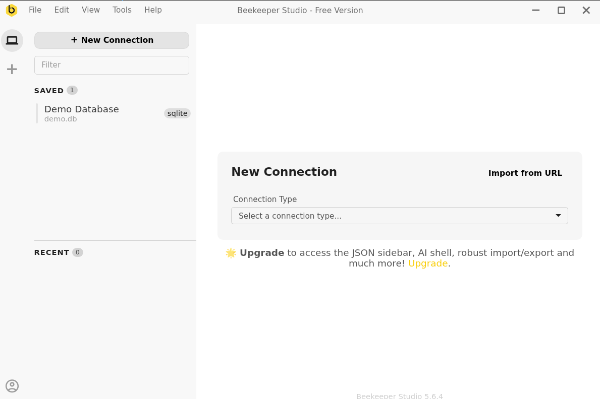
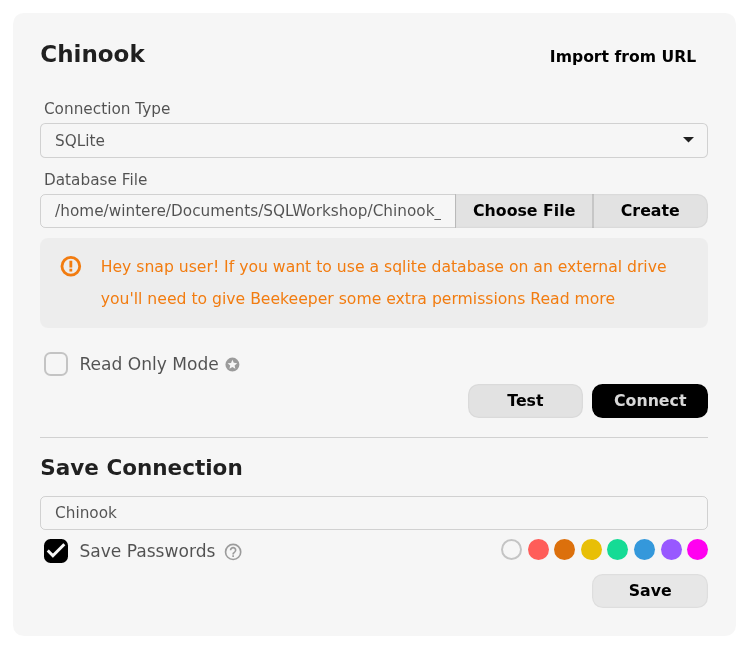

## Why Beekeeper Studio?

This workshop uses the community version of [Beekeeper Studio](https://www.beekeeperstudio.io/) for the simplicity of its user interface,
which makes it easy for beginners to foucs on learning
SQL syntax and relational database structure without being overwhelmed by the features intended for database *administators*
available in commercial database management software.

Once you've learned a little SQL, I would encourage you to branch out to a more powerful tool. The final lesson in this
workshop will introduce alternatives that are *free* to users with a university affiliation. 
There are differences in SQL dialects, but almost everything you learn in this workshop
can be translated to a different SQL engine or different database management system.

## Install Beekeeper Studio Community Edition

### MacOS

Depending on when you bought your laptop, your Mac may have an Apple Silicon chip or an Intel Chip. 
For Beekeeper Studio to work correctly, you must install the version that corresponds to your laptop's chip.

#### Identify Your Processor Type

1. Click on the Apple icon in the top left corner of your screen.
2. Select *About this Mac*.
3. Look at the line labeled *Chip*.
  - If your chip name begins with Apple, it is an Apple Silicon processor.
  - If your chip name begins with Intel, it is an Intel processor.

#### Download and Install Beekeeper Studio

1. Go to [beekeeper-studio.io](https://www.beekeeperstudio.io/)
2. Click **Download**.
3. Click *Skip to the download*.
3. Download the Mac app version that corresponds to your processor type 
to your Desktop.
4. Navigate to your Desktop and double-click the .dmg file.
5. A window will prompt you to drag the Beekeeper Studio app to your Applications folder.
6. Use **Go**->**Applications** to open your Applications folder.
7. Click **Beekeeper Studio.app**.

### Windows

1. Go to [beekeeper-studio.io](https://www.beekeeperstudio.io/)
2. Click **Download**.
3. Click *Skip to the download*.
4. Download the Windows Installer to your Desktop.
5. Run the `.exe` installer.
6. When prompted, choose to install the application only for you.
7. After the installer finishes, you will be prompted to launch Beekeeper Studio.
 - In the future, you can launch the program for the Windows Start Menu.

## Download the Sample Database: The "Chinook" Music Store 

Real-world relational databases are typically run on a *server*, a continously running computer accessible by many users or programs simultaneously. However, for teaching 
purposes, we will be using a lightweight database format called SQLite. SQLite is a program
that can read (and write) a database to a specially formatted file stored on your computer.
SQLite is used in mobile apps and other smart devices to store and manage data because it
is simple, portable, and compact.

The [Chinook database](https://github.com/lerocha/chinook-database) represents purchase records for a  digital media store, including 
tables for artists, albums, media tracks, invoices and customers. Think of it as a miniature version of the iTunes Music Store. While the names of the bands and albums
in the dataset are real, the purchase information is completely fictional.
This dataset is popular for teaching because it's open-source, demonstrates good
database design principles, and gives students the opportunity to practice a variety
of SQL features. I have simplified the database slightly to fit the time frame of this workshop.

SQLite requires  a *.sqlite* file to run, so you will need to save this file somewhere
in a location you can remember. 

Make a new folder named `SQLWorkshop` in your Documents folder or on your Desktop. Keep
track of this folder for the duration of the workshop.

Click the button below to download a copy of the Chninook database to your computer. 
Save or copy the file to your `SQLWorkshop` folder.

<a href="files/Chinook_Sqlite.sqlite" download>
  <button type="button" class="btn btn-primary">Download Database File</button>
</a>

## Import the Sample Database into Beekeeper Studio

{width=700 fig-align="left"}

Now that you have the database file stored in your SQLWorkshop, launch
Beekeeper Studio. You will be prompted to create a new database connection.

Select *SQLite* from the **Connection Type** drop-down menu. Then, click the
**Choose File** button and select the `Chinook_Sqlite.sqilte` file inside your
`SQLWorkshop` folder. Give your connection a name you can remember, like Chinook.

{width=700 fig-align="left"}

Once you've completed these steps, click the **Test** button. If the
connection succeeds, click the **Connect** button. 

::: {.callout-tip}
## Need Help?
If the connection test fails,
please raise your hand or type in the Zoom chat. Someone
will help you troubleshoot your configuration.
:::

## Optional: Configure Beekeeper Studio

Congratulations! You're now set up to do this workshop. If you would
like to tailor Beekeeper Studio to your preferences, you can
adjust its appearance by going to **View** -> **Theme** in the top menu bar.
